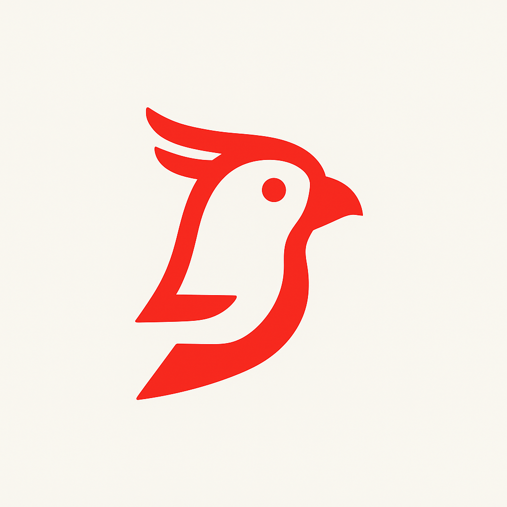

# Hermes AI Agent Framework

**Current Version: 0.2.9**

<p align="center">
    
</p>

<p align="center">
  
  
  
  
  
</p>

## 🚀 Smart LlamaIndex Abstraction for AI Agents

Hermes is a lightweight, powerful abstraction layer over LlamaIndex that simplifies building production-ready AI agents with essential utilities and multi-agent capabilities.

## ✨ Features

- **🛠️ Automatic Tool Integration** - Convert Python functions to tools effortlessly
- **🤖 Multi-Agent Orchestration** - Coordinate multiple specialized agents
- **🧠 Enhanced Prompt Management** - Built-in Chain of Thought and context awareness
- **💬 Smart Memory Management** - Automatic chat history handling with configurable limits
- **🔌 Multi-Provider Support** - OpenAI, Azure, Anthropic, and more
- **📊 Text Processing Utilities** - Keyword extraction, formatting, and enhancement

## 🚀 Quick Start

```bash
pip install hermes-ai
```

```python
import asyncio
from hermes.core import Agent

async def main():
    # Create a simple tool
    def get_weather(location: str) -> str:
        """Get weather information for a location."""
        return f"Weather in {location}: Sunny, 25°C"

    # Initialize your agent
    agent = Agent(
        provider="openai",
        model="gpt-4o-mini",
        name="WeatherAssistant",
        description="Helps with weather information",
        prompt="Provide accurate and helpful weather updates.",
        tools=[get_weather]
    )

    # Execute the agent
    response = await agent.execute(input_data="What's the weather in Tokyo?")
    print(response)

asyncio.run(main())
```

**Output:**
```
Using the weather tool, I can see that the weather in Tokyo is Sunny with a temperature of 25°C. It's a beautiful day!
```

## 💬 Simple Chat Example

```python
import asyncio
from hermes.core import Agent

async def main():
    # Initialize agent
    agent = Agent(
        provider="openai",
        model="gpt-4o-mini"
    )
    
    # Ask a question
    response = await agent.execute(input_data="Qual é a capital do Brasil?")
    print(response)
    # Output: A capital do Brasil é Brasília. Ela foi oficialmente 
    # inaugurada em 21 de abril de 1960...

asyncio.run(main())
```

## 🏗️ Multi-Agent System

```python
import asyncio
from hermes.core import Agent

async def main():
    # Define specialist tools
    def get_market_info(query: str) -> str:
        """Get current market conditions and trends."""
        return "Market is bullish today with major indices up 2%. USD at R$ 5.10."
    
    def calculate_investment(amount: float, period: int) -> str:
        """Calculate investment returns with recommendations."""
        expected_return = amount * (1 + 0.12) ** (period / 12)
        return f"Investment of R$ {amount:,.2f} for {period} months: Expected return R$ {expected_return:,.2f}"
    
    # Create specialized agents
    market_agent = Agent(
        provider="openai",
        model="gpt-4o-mini",
        name="MarketAnalyst",
        description="Expert in market analysis and quotes",
        tools=[get_market_info]
    )

    investment_agent = Agent(
        provider="openai",
        model="gpt-4o-mini",
        name="InvestmentAdvisor", 
        description="Expert in investment planning",
        tools=[calculate_investment]
    )

    # Coordinator agent that delegates to specialists
    coordinator = Agent(
        provider="openai",
        model="gpt-4o-mini",
        name="Coordinator",
        description="Routes questions to appropriate specialists",
        prompt="""Analyze user questions and delegate to the right expert:
        - Market questions → MarketAnalyst
        - Investment questions → InvestmentAdvisor
        - Complex questions → consult both""",
        tools=[market_agent, investment_agent]
    )
    
    # Execute coordinated task
    result = await coordinator.execute(
        input_data="Should I invest R$ 10000 for 12 months? What's the market like?"
    )
    print(result)

asyncio.run(main())
```

## 🔧 Core Components

### Agent Configuration
```python
Agent(
    provider="openai",           # LLM provider
    model="gpt-4o-mini",        # Model name
    name="Assistant",           # Agent identity
    description="Helpful AI",   # Agent purpose
    prompt="Behavior guidelines", # System prompt
    tools=[function1, function2], # Available tools
    temperature=0.7,            # Creativity control
    max_chat_history_length=20  # Memory management
)
```

### Built-in Utilities
- **Automatic tool conversion** from Python functions
- **Enhanced prompt formatting** with current context
- **Chat history management** with configurable limits
- **Input enhancement** with keyword extraction
- **Multi-provider LLM support**

## 📁 Project Structure

```
hermes/
├── core.py          # Main Agent class
├── utils.py         # Text processing utilities
├── tools.py         # Tool creation helpers
└── providers.py     # LLM provider configurations
```

## 🎯 Use Cases

- **Customer Support Agents**
- **Multi-Domain Expert Systems** 
- **Research Assistants**
- **Data Analysis Tools**
- **Content Generation Systems**

## 🔮 Roadmap

- [ ] Vector database integration
- [ ] Advanced memory backends
- [ ] Streaming responses
- [ ] Plugin system
- [ ] Web interface

## 💡 Contributing

We welcome contributions! Please see our [Contributing Guide](CONTRIBUTING.md) for details.

## 📄 License

MIT License - see [LICENSE](LICENSE) file for details.

---

<p align="center">
  <em>Build intelligent agents faster with Hermes - The messenger of AI capabilities</em>
</p>